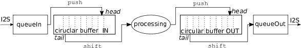

# teensy_FrequencySmearing
## Table of content
- [Authors](#authors)
- [Idea and background](#idea-and-background)
- [Hardware used](#Hardware-used)
- [MATLAB code](#matlab-code)
- [Implementation on TEENSY](#implementation-on-teensy)
- [Limitations, improvements and future work](#limitations-improvements-and-future-work)
- [References](#references)

## Authors
**Supervisor**
* Bastian Epp <bepp@elektro.dtu.dk>

**Author**
* Vassili Cruchet <vassili.cruchet@gmail.com>

## Idea and background
One of the consequences of hearing impairment, is a decrease in the ability to discriminate frequency. This can be modeled by smearing the audio spectrum. The idea and goal of this project is to implement a smearing algorithm on an embedded platform to process audio in real-time. This could then be used as a demonstrator in different events where people would wear headphones and experience this aspect of hearing impairment and the deficit in communication that comes with it. In practice, the algorithm was first implemented in MATLAB to test it off-line with different parameters. Secondly, the algorithm was implemented on a microcontroller-based platform (TEENSY 3.6) which integrate a DSP co-processor with which complete libraries can be used.
For a full documentation, see the [PDF documentation](Teensy_HI_Simulator_Documentation.pdf)

### Smearing principle
In a general maner, frequency smearing consists in convolving each frequency component of the spectrum with an auditory filter centered on the corresponding frequency. The auditory filter is modeled as a _roex(p)_ function where _p_ is a tuning factor for the filter that can be modified to broaden the filter. The wider the filter is, the more the input spectrum will be smeared and smoothened.

##Hardware used
The platform used is a [TEENSY 3.6 board](https://www.pjrc.com/store/teensy36.html), that uses an ARM Cortex-M4F is a 32 bit processor, clocked at 180MHz. 
It is combined to the [TEENSY audio shield](https://www.pjrc.com/store/teensy3\_audio.html) is used to provide audio interface in a high 16 bits quality.
It is therefore based on the [PJRC Audio Library](https://www.pjrc.com/teensy/td_libs_Audio.html) and a modified version of the [CMSIS DSP library](https://www.keil.com/pack/doc/CMSIS/DSP/html/index.html).

## MATLAB code
### Smearing algorithm
Two main scripts are used to test the smearing algorithm with `frequency_smearing.m` and without `test_frequency_smearing.m` block-processing. They both use the following functions:

* `Y = smearing(X, A_s)` Smears the power spectrum `X` with the smearing matrix `A_s` previously calculated with`A_s = calc_smear_matrix(fs, N, b)`.
* `A_s = calc_smear_matrix(fs, N, b)` Calculates the smearing matrix `A_s` of size (N/2 * N/2), with N being the length of the frame to process. It uses the auditory filter calculated by `A_s = calc_audit_filter(fs, N, b)`. `b>1` is the smearing coefficient, (when `b=1`, the spectrum is unchanged).

The script `Moore_comparison.m` is used to compare the algorithm with results presented by Baer and Moore in [1](#references).
### Data generation for C-code
As the smearing matrix is unique for given parameters, it is first calculated in MATLAB and hard coded in the memory of the TEENSY by simply defining arrays. As memory usage is crucial in an embedded system, the row-indexed sparse storage method (described in [2](#references)) was used to store the matrix's coefficient in a more judicious way.
This is done with the scripts `generate_smear_matrix.m` that prints the coefficient in a text file using either row-indexed sparse storage or normal two-dimensional array. The content of this file can then be copy-pasted in the C-code (in `smear_mat.h`) to declare the arrays containing the smearing coefficient corresponding to the desired parameters. For instance the following parameters:
```
fs = 16e3;			% sampling frequency
N  = 4;				  % frame length
b  = 6;				  % smearing coefficient
tol = 1e-6;			% thershold used for compressed storage
```
will output this line of code for classical storage:
```
float smear_mat_b6[2][2] = {{1.000000, 0.000000}, {0.00000, 1.000000}};
```
and those two lines for row-indexed sparse storage:
```
unsigned int ija_b6[3] = {3, 3, 3};
float sa_b6[2] = {1.000000, 1.000000};
```

## Implementation on TEENSY
The programm essentially executes three main tasks:
* **Real-time block processing**. This take part of the whole data flow, from fetching data from the audio shield, managing input and output circular buffers and sending the data back to the audio shield. In total, four buffers are used as illustrated by the diagramm below: 


* **FFT and IFFT transforms**. The CMSIS DSP library is used for all transforms functions as well as for vector operations. Note that for compatibility with the audio library an older version (1.1.0) must be used. Therefore it is not needed to install the full library, one can simply include `arm_math.h` that comes with the installation of TEENSY. The radix 2 functions are a bit slower that the radix 4, but they are more flexible regarding possible length of the frame to process. Complex vectors are reprensented in one array according to the CMSIS convention: `{real[0], imag[0], real[1], imag[1], ...}`.
* **Smearing algorithm**. The smearing matrices are calculated in MATLAB and hard-coded in the memory. Therefore the smearing function is simply a matrix multiplication. When row-index sparse storage method is used the multiplication is done with the function `sprsax`.

Detailed desrciption of all the functions can be found in the [complete documentation](Teensy_HI_Simulator_Documentation.pdf).

## Limitations, improvements and future work
While the basic task is operational, a lot of improvements can be brought to the project in order to reach a usable demonstrator. This concerns mostly operation flexibility and user interface but the algorithm can also be refined with for instance the use of asymetrical auditory filters, as suggested in [1](#references).
At this point the remaining tasks to be done are:
- [ ] **Possibility to change smearing coefficient in-line**: This implies an important restructuring of the way smearing matrices are compiled. Now, only one is compiled according to constant parameters defined in `constant.h`. This approach was taken to solve memory issues, however it would be possible to compile several matrices and alterable parameters.

- [ ] **Implement more different window lengths to investigate effect of frequency resolution**: In the MATLAB off-line tests, frequency resolution have an important impact on the influence of the algorithm. To adjust this parameter, more hann windows need to be implemented (currently, only a frame length of 256 samples is possible) and potentially more smearing matrices. The FFT/IFFT functions also have a limited number of available frame lengths (16, 32, 64, 128, 256, 512, 1024, 2048 according to this [thread](https://forum.pjrc.com/threads/35277-arm_math-h-and-the-FFT-audio-blocks)).

- [ ] **Record audio samples for further analysis**: It would allow to characterize the performance of the embedded algorithm in a more rigorous way.

- [ ] **Add adjustable low-pass filter**: Loss of high frequency sensitivity is also an effect of hearing impairment that could be implemented in the simulator. Note that as the sampling frequency is lowered to 16kHz, the audio input is already low-pass filtered at 8kHz.

- [ ] **Implement asymmetrical broadening**: Bear and Moore [1](#references) describe that most subjects with cochlear hearing loss have the lower branch of their auditory filter broader than the upper branch. They also showed that a broader lower branch have greater effect on speech intelligibility. Therefore, being able to implement asymmetrical broadening would simulate in a more realistic way hearing loss and would also probably increase the effects of the algorithm.

- [ ] **Implement stereo processing**: Even if that represent a big step in the developpement and would maybe require two devices running in parallel, stereo processing would be closer to real hearing impairment and allow a more immersive experience for the subjects.

- [ ] **Improve hardware packaging and user interface**: A final demonstration kit would ideally be integrated into headphones and have a simple and flexible user interface to modify parameters as output level, cut-off frequency of the low-pass filter, smearing coefficient, etc. It could also be possible to have a third party (or some automatic sequence in the programm) that modifies these parameters independently of the user's will.

## References
1. Thomas Baer and Brian C. J. Moore. _“Effects of Spectral Smearing on the Intelligibility of Sentences in Noise”_. en. In:The Journal of the Acoustical Society of America 94.3 (Sept. 1993), pp. 1229–1241.
2. William H. Press et al. _Numerical Recipes in C: The Art of Scientific Computing, Second Edition._ English. 2 edition. Cambridge ; New York: Cambridge University Press, Oct. 1992

